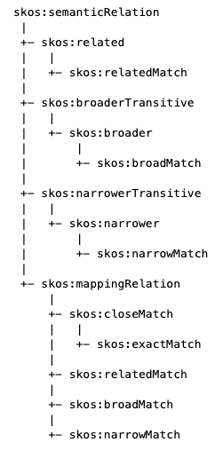
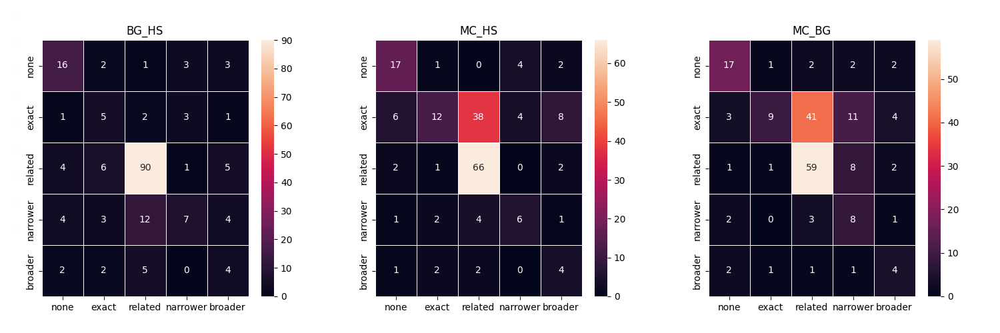

# Alignment of French Resources

This repository contains resources and codes to run experiments on aligning the *[Trésor de la Langue Française informatisé](https://www.atilf.fr/ressources/tlfi/)* and the French Wiktionary -- [Wiktionnaire](https://fr.wiktionary.org/wiki/Wiktionnaire:Page_d%E2%80%99accueil).

## Data Extraction
In addition to [codes/main.py](codes/main.py), two of the provided scripts can be used within other applications and are described as follows:

- [codes/dbnary.py](codes/dbnary.py) retrieves data from Wiktionnaire through [DBnary](http://kaiko.getalp.org/about-dbnary/)'s SPARQL endpoint
- [codes/tlfi.py](codes/tlfi.py) extracts relevant information from TLFi by reaching out to specific tags and paths in the XML files. To reduce complexity in the hierarchy of senses, all senses are flattened and provided at the same level. Extraction of definitions was particularly challenging due to lack of distinction between the definition of the entry versus that of the locution/idioms which also appear in the same entry. For example, *mur* (noun) comes with over 60 definitions in (TLFi)[https://www.cnrtl.fr/definition/mur] among which only a couple of them define the entry and the other, focus on locutions, idioms or multi-word expressions as in "*mur des Lamentations, des Pleurs.*" and "*mur ossaturé*".

In both resources, the microstructure of each entry is reshaped as follows:

- *puissamment* from TLFi (See [https://www.cnrtl.fr/definition/PUISSAMMENT])

```
{
    "gender": "",
    "id": "69866",
    "lemma": "puissamment",
    "pos": "adverb",
    "senses": {
        "A.": "Très, à un degré élevé, avec force.",
        "B.": "Avec efficacité, grandement.",
        "C.": "Avec de la force physique; de façon marquée.",
        "D.": "Avec des moyens puissants, fortement."
    }
} 
```

- *puissamment* from Wiktionnaire (See [https://fr.wiktionary.org/wiki/puissamment])

```
{
    "http://kaiko.getalp.org/dbnary/fra/puissamment__adv__1": {
        "lemma": "puissamment",
        "pos": "adverb",
        "gender": "",
        "senses": {
            "http://kaiko.getalp.org/dbnary/fra/__ws_2_puissamment__adv__1": "Avec force.",
            "http://kaiko.getalp.org/dbnary/fra/__ws_4_puissamment__adv__1": "(Par extension) très.",
            "http://kaiko.getalp.org/dbnary/fra/__ws_1_puissamment__adv__1": "Avec puissance.",
            "http://kaiko.getalp.org/dbnary/fra/__ws_3_puissamment__adv__1": "Extrêmement."
        }
    }
}
```

## Data Annotation

Based on the lemmata used in the [MWSA datasets](https://github.com/elexis-eu/mwsa) (which are based on the English WordNet), we retrieve the synsets associated to the word in the French language based the Open Multilingual WordNet. The is beneficial to carry out cross-lingual word-sense alignment tasks in the future.

The relevant information are then extracted for these words in French as described in the previous section. Given a lemma with identical part-of-speech and gender in TLFi and Wiktionnaire, a combination of all possible definition/sense matches are provided. This way, the annotator can select one of the following relations between every pair of senses in the two resources:

- `none`: the two senses/definitions are not referring to the same concepts, i.e. meanings
- `exact`: the two senses/definitions are semantically identical. In our meeting on September 29th, we referred to this category as *strict exact* indicating the fact that the two senses/definitions should strictly be identical.
- `broader`: the first sense/definition completely covers the meaning of the second one and is applicable to further meanings
- `narrower`: the first sense/definition is entirely covered by the second one, which is applicable to further meanings.
- `related`: There are cases when the senses may be equal but the definitions in both dictionaries differ in key aspects despite being **semantically related**

These type of relations are based on [SKOS's semantic relations](https://www.w3.org/TR/skos-reference/#semantic-relations). It should be noted that the proposed relations, except `broader` and `narrower`, are symmetric. Therefore, `R(A, B)` equals with `R(B, A)`, where `R()` refers to the relation between `A` and `B`. Regarding `broader`, it is the inverse relation of `narrower`, i.e. if `R(A, B)=broader`, then `R(B, A)=narrower`.

Here are a few examples:

- `livre` (noun, masculine)
    - proposed relation: **`none`**  
        - *Ouvrage constituant un volume imprimé.* (Wiktionnaire)
        - *Registre destiné à recueillir les signatures et les commentaires des visiteurs.* (TLF) 
    - proposed relation: **`exact`**
	    - *Assemblage de feuilles manuscrites ou imprimées destinées à être lues.* (Wiktionnaire) 
        - *Assemblage de feuilles en nombre plus ou moins élevé, portant des signes destinés à être lus.* (TLF)
	- proposed relation: **`narrower`**
        - *Ouvrage qui fait référence à un texte sacré* (Wiktionnaire) 
        - *Ouvrage imprimé, relié ou broché, non périodique, comportant un assez grand nombre de pages.* (TLF)
	- proposed relation: **`broader`**
        - *Ouvrage constituant un volume imprimé.* (Wiktionnaire)
        - *Ouvrage en vers ou en prose, d'une certaine étendue.* (TLF) 
    - proposed relation: **`related`**
        - *Chacune des parties principales de certains ouvrages.* (Wiktionnaire)
        - *Ensemble de feuilles de parchemin ou de papier écrites des deux côtés et rassemblées en cahiers* (TLF)

The following, is another example that we annotated together for the word *bannissement* (noun) in [TLF](https://www.cnrtl.fr/definition/11377) and [Wiktionnaire](http://kaiko.getalp.org/dbnary/fra/bannissement__nom__1):

| TLF                                                                                                                                                   | Relation | Wiktionnaire                                                                                         |
|-------------------------------------------------------------------------------------------------------------------------------------------------------|----------|------------------------------------------------------------------------------------------------------|
| Peine politique criminelle infamante consistant dans la défense, pour le condamné, de résider sur le territoire national pendant une durée déterminée | none     | Action de bannir, d’expulser une personne en lui interdisant de revenir ou résultat de cette action. |
| Simple mesure d'éloignement prise à l'égard de certaines personnes, notamment des membres de familles ayant régné                                     | related  | Action de bannir, d’expulser une personne en lui interdisant de revenir ou résultat de cette action. |
| Éloignement imposé de quelque chose                                                                                                                   | related  | Action de bannir, d’expulser une personne en lui interdisant de revenir ou résultat de cette action. |
| Action de bannir; état qui en résulte                                                                                                                 | exact    | Action de bannir, d’expulser une personne en lui interdisant de revenir ou résultat de cette action. |

<!-- 
🆕 (update on Sep. 15th) Given the complexity of some sense distinctions, particularly those that may be annotated as **`related`** or **`exact`**, we follow the definitions of exact and related according to [SKOS Simple Knowledge Organization System (SKOS)](https://www.w3.org/TR/skos-reference). Based on this data model, **`related`** and **`exact`** are respectively equivalent to `skos:related` and `skos:exactMatch`. The followings shows the hierarchy of properties in this data model:



Therefore, other types of semantic relations, such as `broader` and `narrower` can be considered as `related` as they are subclasses of that property (not to be confused with `skos:relatedMatch`). According to [Section 10.6.1. in the reference](https://www.w3.org/TR/skos-reference/#mapping), mapping properties `skos:broadMatch`, `skos:narrowMatch` and `skos:relatedMatch` are provided for a more fine-grained organization of concepts arguing that:

> The rationale behind this design is that it is hard to draw an absolute distinction between internal links within a concept scheme and mapping links between concept schemes. This is especially true in an open environment where different people might re-organize concepts into concept schemes in different ways. What one person views as two concept schemes with mapping links between, another might view as one single concept scheme with internal links only. This specification allows both points of view to co-exist, which (it is hoped) will promote flexibility and innovation in the re-use of SKOS data in the Web. 
In order to evaluate the level of (dis)agreement among annotators, we will then calculate an inter-annotator agreement such as [Fleis's Kappa](https://en.wikipedia.org/wiki/Fleiss%27_kappa). -->


## Inter-annotator agreement

<!-- As of September 15th, Krippendorff's alpha for the two datasets of the two groups of annotators is as follows:

- Group 1 (annotated by Mathieu, Hee-Soo and Bruno): **0.29**. 228 pairs of definitions are annotated.
- Group 2 (annotated by Karen and Sina): **0.39**. 227 pairs of definitions are annotated.

The following figure illustrates heatmaps of how each two annotators perform comparatively: 



Here are the comparison of the annotations of [group_1](output/annotation/Groupe_1_all.tsv) and [group_2](output/annotation/Groupe_2_all.tsv).
 -->


## Alignment techniques


## Experiments


